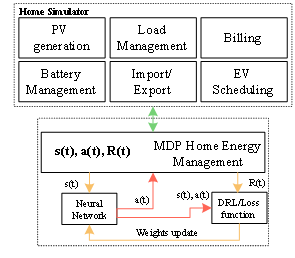
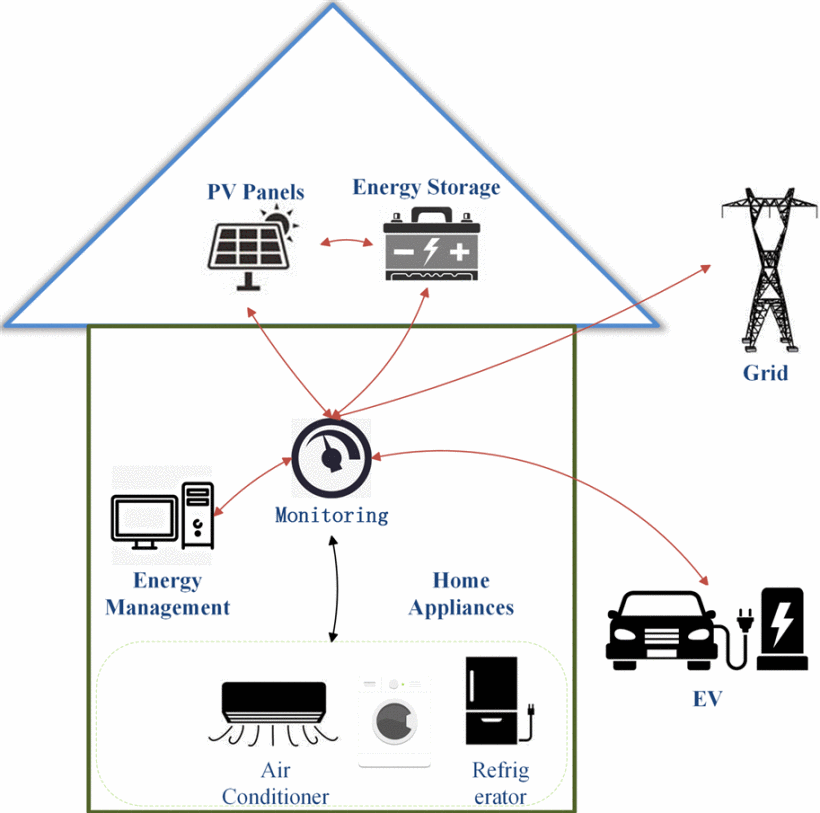
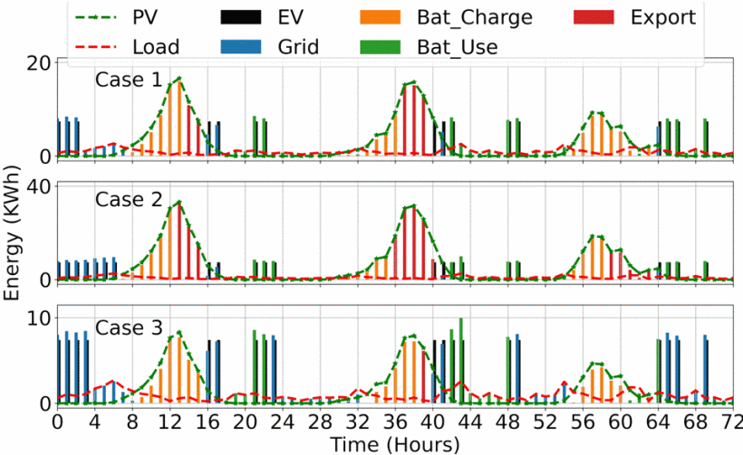
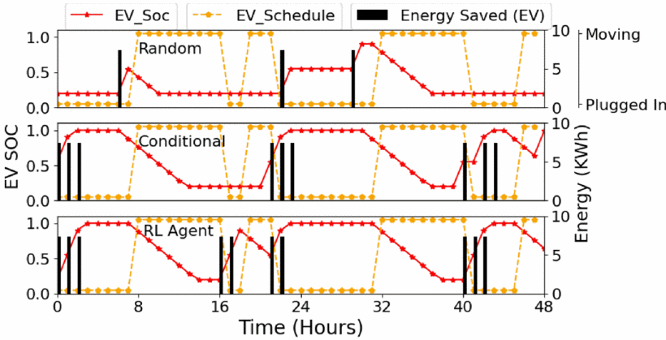
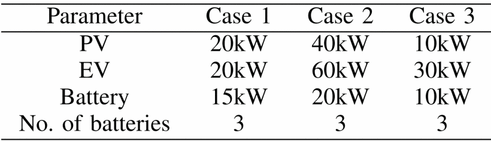
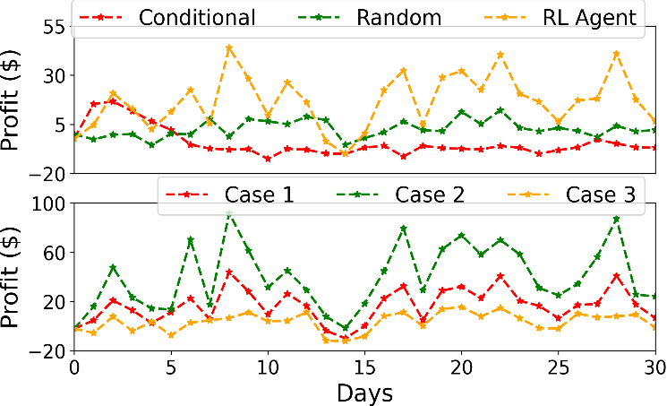
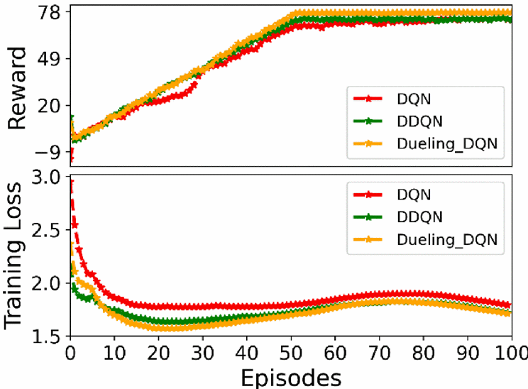

# ⚡ Intelligent-Home-Energy-Management and EV Scheduling

## 🚀 Smart Scheduling of EVs Through Intelligent Home Energy Management Using Deep Reinforcement Learning

---

## 🧾 Abstract

This article presents the deep reinforcement learning (DRL)-based smart scheduling in an intelligent home energy management system (SSIHEMS) for electric vehicles (EVs), utilizing rooftop photovoltaic (PV) generation. Optimizing home appliances to minimize consumption cost is challenging due to the randomness of electricity prices. The model-free DRL-based SSIHEMS aims to address this by managing home appliances and EV scheduling to reduce grid dependency.

Decisions include battery charging/discharging and EV scheduling using a collaborative approach. A custom gym environment feeds system states to the agent and receives a reward based on action selection. A case study validates the approach, showing effective scheduling with PV generation. Comparative analysis with traditional methods confirms the superiority of the DRL-based system.

🔗 **[Read the Paper](https://ieeexplore.ieee.org/abstract/document/10004664)**

---

## 🎯 Objective

The system integrates energy storage (ES), home loads, and PVs to manage energy optimally. The goal is to reduce utility dependency by storing surplus renewable energy. With declining ES costs (now just a few hundred $/kWh), using clean energy has become viable for achieving zero carbon emissions.

The system manages common appliances—air conditioners, refrigerators, microwaves, and washing machines—using a data-driven DRL-based controller.

---

## 🧠 System Architecture

---

## 🗃️ Appliances Used & Dataset

A large, open-source dataset from **Pecan Street Inc.** was used. It spans multiple years; a few weeks were selected for this case study. Appliances tracked include:

- Refrigerator
- Air Conditioner
- Dishwasher
- Washing Machine
- Microwave
- Lighting
- Clothes Dryer
- Overall House Load

Data points were recorded every 15 minutes for one year. Data wrangling was performed to extract technical characteristics of each appliance.

---

## 📊 Time Series Data Visualization

### Power Consumption Trends

### Appliance-Wise Dataset Mapping

---

## 🔁 Sequential Decision Management

Reinforcement Learning (RL) is a sequential decision-making algorithm. The environment simulates energy decisions across a 24-hour period.

---

## 🔌 EV Scheduling at Profitable Times

The DRL agent schedules EV charging to minimize cost and utilize profitable electricity rate periods.

---

## ⚠️ Generalizability Across Scenarios

System behavior is tested against unseen power scenarios to assess the RL model’s generalization capabilities.

---

## 💸 Profit-Oriented Energy Management

The agent learns to store energy when rates are low and sell or use it when rates are high—**without compromising user comfort**.

---

## 📈 RL Agent Performance Metrics

Training progress is validated via reward and loss curves. A stable reward and low loss indicates successful learning, especially as stochastic noise trends to zero.

---

## 📚 Citation

@inproceedings{suleman2022smart,
  author    = {A. Suleman and M. A. Amin and M. Fatima and B. Asad and M. Menghwar and M. A. Hashmi},
  title     = {Smart Scheduling of EVs Through Intelligent Home Energy Management Using Deep Reinforcement Learning},
  booktitle = {2022 17th International Conference on Emerging Technologies (ICET)},
  location  = {Swabi, Pakistan},
  year      = {2022},
  pages     = {18--24},
  doi       = {10.1109/ICET56601.2022.10004664},
  keywords  = {Deep learning; Photovoltaic systems; Home appliances; Costs; Transportation; Reinforcement learning; Electric vehicles; Deep reinforcement learning; Home energy management; EV; demand response}
}

