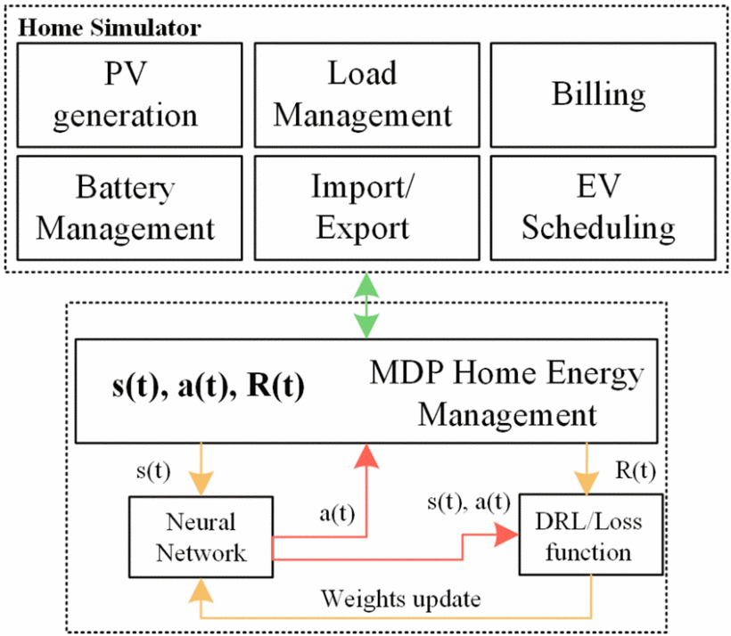
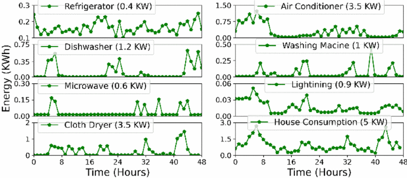

# Intelligent-Home-Energy-Management and EV Scheduling
## 🚀 Smart Scheduling of EVs Through Intelligent Home Energy Management Using Deep Reinforcement Learning
## 🧾 Abstract
This article presents the deep reinforcement learning (DRL) based smart scheduling in intelligent home energy management system (SSIHEMS) for electric vehicles (EVs) by utilizing the photovoltaic (PV) on the rooftop. Therefore, optimizing home appliances to minimize consumption cost is challenging because of the randomness of electricity prices and poses a challenge for efficient scheduling. The data-driven model-free DRL-based SSIHEMS is utilized to optimize the decision by managing different home appliances and offering appropriate scheduling of EVs to overcome the shortcomings. The decision includes the proper scheduling of battery charging, discharging, and EV to reduce the dependency on the electric grid through a collaborative approach. In addition, the proposed work covers designing a gym-based environment that incorporates the states fed to an agent and receives the reward based on the action taken for scheduling. Hence, the case study is performed to validate the proposed approach. It is verified that the decisions for battery charging, discharging, and EV scheduling are managed well through PV generation with respect to time. Furthermore, a comparative study of deep reinforcement learning and conventional techniques verifies the effectiveness of DRL.
### 🌐 Paper Link https://ieeexplore.ieee.org/abstract/document/10004664

# 🎯 Objective / Goals

The proposed system utilizes energy storage (ES), home loads, and PV for the energy management problem; the system model is shown in Fig.1, which helps to reduce the dependency on the utility by storing the surplus energy generation through renewable energy. It is important to note that the initial cost of ES has dropped to a few hundred $/kWh within the following decades and encouraged to utilize of clean energy for zero carbon emission. The data-driven home appliances are considered for the proposed work, including air conditioners, refrigerators, microwaves, and washing machines.

[

# 🗃️ Appliances used

The large open-source data set is used given by Pecan Street. Inc. It includes several years' data, and for the case study, data for a few weeks has been considered randomly in Fig. 
In addition, the data includes the power consumption concerning the time of a refrigerator, air conditioner, dishwasher, washing machine, microwave, lighting, cloth dryer, and normal house consumption. Hence, the case study performs for one house for over one year every 15 minutes. It is important to note that most of the components in the environment are taken from the datasets; we perform the data wrangling to get a technical characteristic of different appliances.
## Time Series Data Visualization
[
[

# Sequential decision managenment in the hours of a day. RL is a sequential algorithm. 

[
[
[
[
[

> A short, catchy description of your project goes here.

  

---

## 📦 Features

- ⚡ **High Performance** – Optimized for speed and scalability.
- 🧠 **Smart Algorithms** – Uses modern AI/ML approaches.
- 🛠️ **Easy Integration** – Simple APIs and modular design.
- ✅ **Well Tested** – Includes unit and integration tests.
- 📚 **Documented** – Clean code with detailed documentation.

## 🏁 Getting Started

### 🔧 Prerequisites

### 🛠️ Installation

# 🧾 Abstract / Overview
# 🚀 Project Title / Introduction
# 🎯 Objective / Goals
# 📦 Features / Highlights
# ⚙️ Architecture / System Design
# 🧠 AI / ML / Intelligence
# 🔍 Analysis / Insight / Review
# 📊 Results / Evaluation / Metrics
# 🏁 Getting Started / Quickstart
# 🔧 Prerequisites / Requirements
# 🛠️ Installation / Setup
# 🚀 Usage / Run
# 📁 Project Structure / File Tree
# 🧪 Tests / Testing
# 🛡️ Security / Safety
# ♻️ Refactoring / Cleanup
# 📈 Performance / Optimization
# 🧰 Tools / Dependencies
# 🗂️ Modules / Components
# 🗃️ Dataset / Data Files
# 🧪 Experiments / Trials
# 💡 Tips / Suggestions
# 🧾 Documentation / Papers
# 📚 References / Further Reading
# 🙋‍♂️ FAQ / Help / Support
# 🤝 Contributing / Collaborate
# 🧑‍💻 Authors / Developers
# 📄 License / Legal
# 📬 Contact / Connect
# ⭐ Show Your Support / Star Project
# 🌐 Website / Live Demo / App Link
